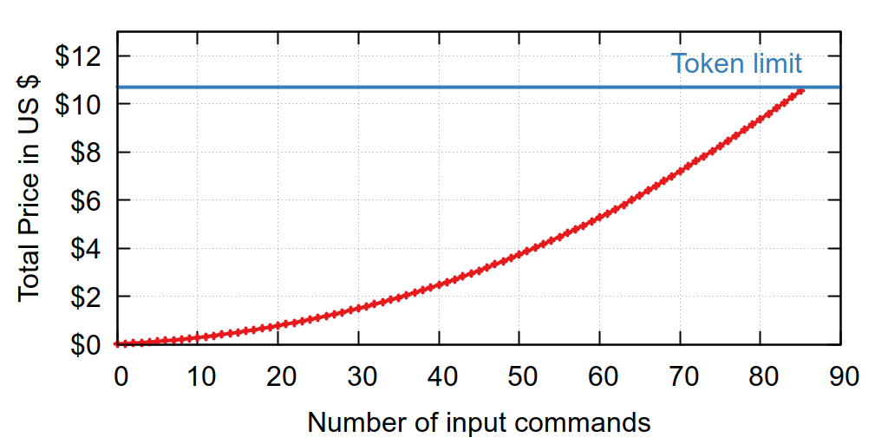

# AdventureAI

How does the new Large Language Models perform?

[9:05 full run](assets/905_full.md)

[9:05 with look under bed](assets/905_police.md)

[9:05 as murderer](assets/905_quit.md)


### Costs for one run



## About

This repository contains an interpreter for Z-Machine files, specifically supporting version 3 and 5 files. The Z-Machine is a virtual machine designed to run text adventure games, such as those created by Infocom.

## Features

- Read and interpret Z-Machine files (versions 3 and 5)
- Execute a predefined list of commands
- Chat with AI

# Compile

Install at least Go V 1.19 and run the following command

```bash
go build
```

# Usage

To use the Z-Machine interpreter, you need to provide the Z-Machine file to run using the `file` flag. Additionally, if you want to enable the AI chat feature, provide the `ai` flag.

```bash
./zmachine -file [filename] [-ai]
```

Replace `[filename]` with the path to your desired Z-Machine file.

### Example:

```bash
go run main.go -file 905.z5 -ai
```

This will run the Z-Machine interpreter on the given file (905.z5), with the AI chat feature enabled.

## Outlook

More Adventures, more language models, more runs. Very simple. The story 9:05 was just the beginning.

But I have to wait until we see a drop of the current prices for large language models. $10 just for one run is not affordable.


