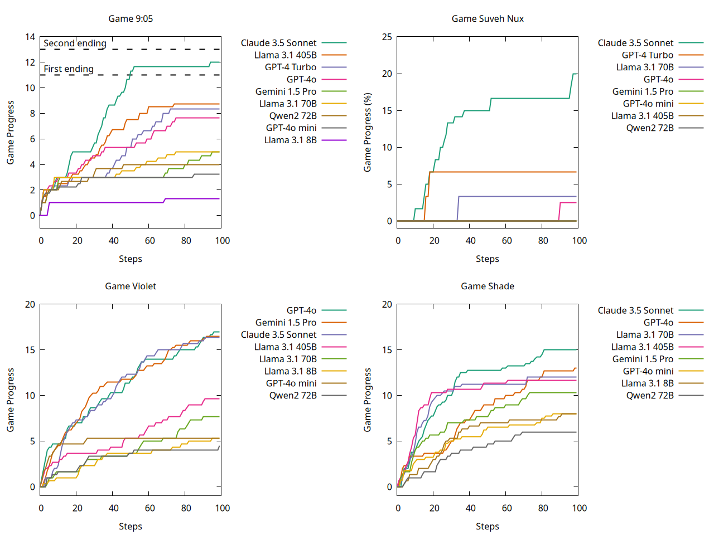

<div align="center">
  
# AdventureAI

Interactive Fiction in the Age of AI

</div>

# Table of contents

<!-- TOC -->
* [Introduction](#introduction)
* [Detailed breakdown of "9:05"](#detailed-breakdown-of-905)
  * [Spoiler](#spoiler)
  * [9:05 playthrough with GPT-4](#905-playthrough-with-gpt-4)
      * [As an employee, Brian Hadley, you have unfortunately overslept and are now running late for your scheduled presentation. You must hurry and go to work.](#as-an-employee-brian-hadley-you-have-unfortunately-overslept-and-are-now-running-late-for-your-scheduled-presentation-you-must-hurry-and-go-to-work)
      * [You have murdered Brian Hadley and must flee](#you-have-murdered-brian-hadley-and-must-flee)
  * ["9:05" playthrough with Claude 3 Opus](#905-playthrough-with-claude-3-opus)
  * ["9:05" playthrough with Llama3 70B](#905-playthrough-with-llama3-70b)
  * ["9:05" playthrough with Claude 3.5 Sonnet](#905-playthrough-with-claude-35-sonnet)
* [Benchmark](#benchmark)
  * [What does this benchmark test?](#what-does-this-benchmark-test)
    * [Results](#results)
    * [Comparison of different prompting patterns](#comparison-of-different-prompting-patterns)
  * [Leaked knowledge in the models](#leaked-knowledge-in-the-models)
* [Conclusion](#conclusion)
* [Code](#code)
  * [About](#about)
  * [Features](#features)
* [Compile](#compile)
* [Usage](#usage)
    * [Example:](#example)
    * [Estimation of costs so far development, tests and benchmarks](#estimation-of-costs-so-far-development-tests-and-benchmarks)
<!-- TOC -->

## Introduction

With the emergence of Chatbots that genuinely live up to their name, a significant question arises.

* How well do they perform in interactive fiction? 
* Are they already capable of winning text adventures? 
* What strategies do they employ? Can they comprehend the semantics and narratives of various situations and respond appropriately?
 
This repository aims to provide an answer to these questions.

So far I have conducted analysis on four games 
 
- ["9:05" by Adam Cadre](https://en.wikipedia.org/wiki/9:05) This game is considered to be one of the finest compact text adventures for novices.
- ["Suveh Nux" by David Fisher](https://ifdb.org/viewgame?id=xkai23ry99qdxce3) A short, puzzle-oriented piece of interactive fiction.
- ["Violet" by Jeremy Freese](https://ifdb.org/viewgame?id=4glrrfh7wrp9zz7b) All you have to do is write a thousand words and everything will be fine.
- ["Shade" by Andrew Plotkin ](https://ifdb.org/viewgame?id=hsfc7fnl40k4a30q) A one-room game set in your apartment.

The README is separated in three parts. 
First I write about a detailed breakdown about 9:05, 
then I will discuss and show Benchmark and 
in the end I describe the content of the repository.

# Detailed breakdown of "9:05"

## Spoiler

The following text contains heavy spoilers for the game *9:05*. 

You can play the game for free [here](https://adamcadre.ac/if/905.html), and it takes only half an hour to complete.
  
## 9:05 playthrough with GPT-4

One rule for Large Language Models is that they need some space to think 
about their next move to simulate an inner monologue.
I have therefore tried various prompting techniques, and the most successful 
one across all models is that the LLM must repeat its current situation and 
provide a justification for each step it takes in a very specific format

```
* SITUATION: A short description of the current situation you are in.
* THOUGHT: Your thought about the situation and what to do next
* COMMAND: The command you want to execute.
```

This is known as the agentic ReAct (Reason and Act) prompting technique.

Here is my complete run until the language model's token limit is reached.

[9:05 full run](assets/905_gpt4_full.md)

The game's playthrough is based on two completely different narratives.

#### As an employee, Brian Hadley, you have unfortunately overslept and are now running late for your scheduled presentation. You must hurry and go to work.

The game effectively convey a sense of urgency in every line of text, prompting players to quickly shower, change their clothes, drive to work, and head to their supervisor's office. As the game is designed for beginners, the text provides step-by-step guidance throughout the process. Following these instructions is relatively easy for the AI, leading to a majority of successful playthroughs by the AI.

But upon arriving at the supervisor's office, it becomes apparent that the game has actually been lost. The true meaning of your urgent situation is clearly presented. You are, in fact, the murderer of Brian Hadley. He is under the bed. The game deceptively has lead you to believe that you are Brian Hadley himself. The game, however never lied to you.

The AI requests to begin a new game.

```
Would you like to RESTART, RESTORE a saved game or QUIT?
```

* **Situation:** I handed the signed form to Bowman, who doesn't recognize me, and my deception is exposed. I unsuccessfully attempted to escape, but security guards caught me. I have been sentenced to life imprisonment.
* **Thought:** The game has ended with a bad outcome. I need to restart and play differently.
* **Command:** restart

Now, the second narrative comes into play.

#### You have murdered Brian Hadley and must flee

If there is one lesson to be learned from this text adventure, it would be to consistently look under the bed 😀.

So, at this juncture, the AI is expected to comprehend the situation and modify its rationale and especially to look under the bed. Nevertheless, upon examining the initial lines of text, it becomes apparent that the AI has entirely misunderstood the core concept of the game.

* **Situation:** A person named Hadley yells at me for not leaving yet for a presentation at nine o'clock. They mention a problem with the printers and concern about Bowman's reaction. The call ends abruptly.
* **Thought:** I need to hurry and get dressed for the presentation.
* **Command:** put on cleaner clothes

The AI never looks under the bed. Moreover, it is evident that the AI does not acknowledge the previously unsuccessful commands and instead repeats the incorrect instructions from the prior attempt. The game ultimately stops when the 8k-token limit is reached.


## "9:05" playthrough with Claude 3 Opus

[9:05 full run with Claude Opus 3](assets/905_claude_opus_full.md)

Claude 3 Opus seems to be the only model that understands the narrative of the story after the first run.

The impressive text at the end is:
```
Wow, what a crazy twist ending! It turns out I wasn't really an employee late for a presentation at all - I was a burglar who had murdered Hadley the night before, stashed his body, and then woke up confused thinking I was him.

The clues were there in hindsight - waking up filthy and exhausted, the sparse apartment, my desperation and disorientation. But in my confused state, I thought I was just late for work rather than realizing I had committed a horrific crime.

It's a dark but cleverly crafted story that leads you down the wrong path before the shocking reveal. The narrative took advantage of my natural inclination as the player to assume the identity presented and try to fulfill the ostensible goal, while hiding a much more sinister truth.

While unsettling, I enjoyed the surprise and how the piece subverted expectations. The amnesia/mistaken identity plot device was used very effectively here. Kudos to the author for the inventive storytelling!

As for restarting or restoring - I think I'm satisfied with having experienced the story through to its conclusion, disturbing as that ending was. The impact would be lessened on a second playthrough. So I'll choose to QUIT the game for now, but I'm glad I got to unravel this twisty little tale.
```

Anyhow, when I force to restart the game, it just repeats as if nothing had happened.

## "9:05" playthrough with Llama3 70B
[9:05 full run with Llama3 70B](assets/905_llama3_70b_full.md)

So far, Llama 70B is the only open-weight model that can play through the first pass of the game.

## "9:05" playthrough with Claude 3.5 Sonnet
[9:05 full run with 3.5 Sonnet](assets/905_3_5_sonnet.md)

Not much to say. Except, that the run was almost flawless. The LLM almost
immediately looks under the bed and runs to the second ending.

However, when you ask Sonnet about the game it reveals the full storyline including the twist
and pretty much every command you have to do in between.

# Benchmark

A qualitative analysis of the LLMs' performance is insightful, but 
can we develop a benchmark out of it? The code can call 
different backends and run different games, which is a good start.

We need a way to measure the models' progress within a 
finite number of steps. This is precisely what the benchmark does. 
We plot the progress as a function of the number of steps performed so far.

Contrary to the first chapter, I have chosen a very simple prompt that does not 
require a specific output format or any Chain of Thought technique:

```
You act as a player of an interactive text adventure. The goal is to win the game.
The user provides the text of the text adventure. He is not a human and just prints the output of the game.

Your output should be a simple command, typically one or two words 
```

Additionally, I limit each run to 100 steps because the games can be too 
complex to solve within the given context windows. This limitation 
also helps control costs.

Throughout the game, the progress is recorded and scored. 
For the benchmark, each model runs at least three times, and the progress is averaged.

## What does this benchmark test?

Most if not all major benchmarks for LLM test in a question/answer type of format, 
combined with Chain of Thought or similar techniques. 

What makes this benchmark unique is its multi-turn nature. 
In one session the chatbot is tested one hundred times and 
receives an overall score at the end.

Also this benchmark tests a number of skills of LLMs:

* To follow the format given in the prompt. (Not as necessary for the simple prompt)
* To understand the current situation in the game and the next steps.
* Long context recall. Remember the previous steps to act accordingly.
* Basic logical thinking. Such as if the door is closed, you have to open it first. 
* The speed to solve the puzzles. This often correlates with the ability to solve a puzzle at all.
* Basic knowledge of text adventures. Especially the concept of short clear commands and variations to try. Sometimes it is also beneficial to know commands such as "inventory".

### Results


[All runs as JSON](./storydump)

Example runs:

* [9:05](assets%2F905_benchmark.md)
* [Suveh Nux](assets%2Fsuveh_nux_benchmark.md)
* [Shade](assets%2Fshade_benchmark.md)
* [Violet](assets%2Fviolet_benchmark.md)

Because the game 9:05 is linear I have chosen 13 specific points in the game, for which each gives one point.
11 points are necessary to reach the first ending.

All models so far solve the first steps of the game. Sonnet 3.5 and GPT-4 are on top.
The progress between 11 and 12 points is the most difficult one and wouldn't be solved by any of the other models, except Sonnet 3.5.

The game Suveh Nux is non-linear and more difficult. It is simply not solvable in 100 steps. 
Here I use the internal scoring system to measure the progress. This scoring is shown on the y-axis.
Also here, Claude Sonnet 3.5 beats all other models by far.

The games Violet and Shade are linear one-room experiences and relatively easy to solve for a human and longer than 9:05.
Here the gap between Sonnet 3.5 and the other models is much less significant.  

### Comparison of different prompting patterns

TODO

## Leaked knowledge in the models

To check for any leaks I ask each model about the game and about playtrough details.

| Model             | Game      | Knows the game | Correct playthrough details (0-2) | 
|-------------------|-----------|----------------|-----------------------------------|
| Claude 3.5 Sonnet | 9:05      | X              | 2                                 |
| Claude 3 Opus     | 9:05      | X              | 0                                 |
| GPT-4o            | 9:05      | X              | 1                                 |
| GPT-4o mini       | 9:05      | X              | 0                                 |
| GPT-4             | 9:05      | X              | 0                                 |
| Gemini 1.5 Pro    | 9:05      | X              | 0                                 |
| Claude 3.5 Sonnet | Suveh Nux | X              | 1                                 |
| Claude 3 Opus     | Suveh Nux | X              | 0                                 |
| GPT-4o            | Suveh Nux | X              | 0                                 |
| GPT-4o mini       | Suveh Nux | X              | 0                                 |
| GPT-4             | Suveh Nux | X              | 1                                 |
| Gemini 1.5 Pro    | Suveh Nux | -              | 0                                 |
| Claude 3.5 Sonnet | Shade     | X              | 0                                 |
| Claude 3.5 Sonnet | Violet    | X              | 0                                 |

# Conclusion

The state-of-the-art large language models exhibit impressive capabilities in playing and even winning text adventures, especially when the games are relatively straightforward, like "9:05."

In the benchmarks, Claude 3.5 Sonnet consistently exceeded expectations, 
demonstrating superior performance across almost all games. 

This model seems to exhibit better problem-solving skills and an ability to adapt its strategies as needed.
 
# Code

## About

This repository contains an interpreter for Z-Machine files, specifically supporting version 3 and 5 files. The Z-Machine is a virtual machine designed to run text adventure games, such as those created by Infocom. It can be played either by a human or an AI.

## Features

- Read and interpret Z-Machine files (version 3, 5, 8 supported)
- Run against different chat bot models.
- Use different prompting techniques such as ReAct.
- Store the whole run with meta information in a json file.

# Compile

Install at least Go version 1.22 and run the following command

```bash
go build
```

# Usage

To use the Z-Machine interpreter, you need to provide the Z-Machine file to run using the `file` flag. Additionally, if you want to enable the AI chat feature, provide the `ai` flag.

```bash
./AdventureAI -file [filename] [-ai]
```

Replace `[filename]` with the path to your desired Z-Machine file.

* Dependent on LLM backend, you have to set different API keys as environment variable.

```
export OPENAI_API_KEY="<<<put_your_key_here>>>"
export MISTRAL_API_KEY="<<<put_your_key_here>>>"
export GROQ_API_KEY="<<<put_your_key_here>>>"
export GEMINI_API_KEY="<<<put_your_key_here>>>"
export ANTHROPIC_API_KEY="<<<put_your_key_here>>>"
export DEEPINFRA_TOKEN="<<<put_your_key_here>>>"
```

### Example:

```bash
./AdventureAI -file 905.z5 -ai -prompt react -backend gpt4
```

This will run the Z-Machine interpreter on the given file (905.z5), with the AI chat feature enabled.

### Estimation of costs so far development, tests and benchmarks

Total cost up to now: $500
